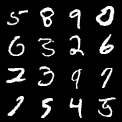

# Model Card - Denoising Diffusion Generation Model
### 1. Model Details
* Developed by Nazar Shmatko
* Diffusion generative model
* Reproduce paper [Denoising Diffusion Probabilistic Models](https://arxiv.org/abs/2006.11239)
### 2. Intended Use
* The model can be used for indefinitely sample generation or as a basis for more complicated DL pipelines.
* The training pipeline can be used for educational purpose before one will try to ride more complicated models. 
### 3. Factors
* Because of stochastic nature of diffusion it is hard to predict model generation behaviour. One can use a fixed seed to makes things easier.
* Model can be trained with more complicated dataset, in this situation it is preferably to design more complicated diffusor network.
### 4. Metrics
* For evaluation frechet inception distance was choosen.
The Fréchet inception distance (FID) is a metric used to assess the quality of images created by a generative model. The FID compares the distribution of generated images with the distribution of a set of real images ("ground truth"). As evaluation dataset MNIST test was used.
* In our experiments we achieve score FID=42. 
* Below are generated image samples.
 
* More samples can be found at [wandb log](https://wandb.ai/cutlass90/uncategorized/runs/7hqk753n?workspace=user-cutlass90)
### 5. Training Data
As training dataset [MNIST train](http://yann.lecun.com/exdb/mnist/) was used.
### 6. Evaluation Data
As evaluation dataset [MNIST test](http://yann.lecun.com/exdb/mnist/) was used.
### 7. Ethical Consideration
This model is fully safe for work. But, as any generative models, it will be trained on NSFW data and become the source of inappropriate content

